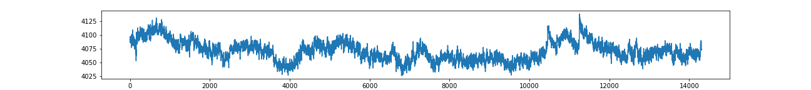
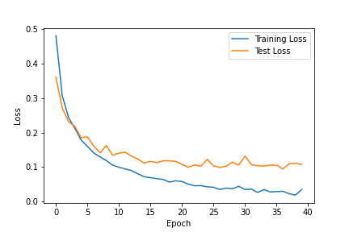
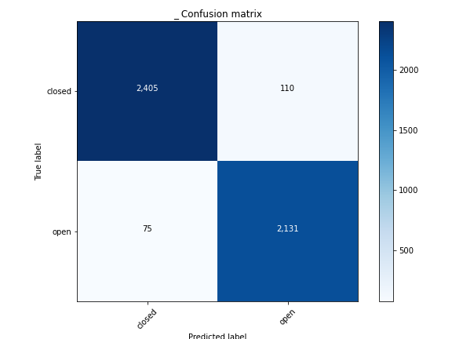

# EEG-Signal-Classification
 14 Channel EEG Time-Series Classification whether eyes of a human are shut or open.
 
## Data
We have 14 channels of EEG time-series signals of the brain activity. In the following we have 4 EEG channels plotted and the label as signal a signal is plotted, whether the human has their eyes shut (0) or open (1):

Based on the brain activity signals, we want to predict if the humand has their eyes shut or open at the moment.

## Results
We are able to distinguish if the eyes are closed or shut based on the 14 EEG channel signals! The metrics for the 2 class classification problem for our model are:
- Accuracy: 96.1%
- Precision: 95.0%
- Recall: 96.6%

 

## Better Results through Feature Engineering
With calculating a rolling mean of every feature and dropping features with low correlation we get the better results:

- Accuracy: 99.9%
- Precision: 99.9%
- Recall: 99.8%

